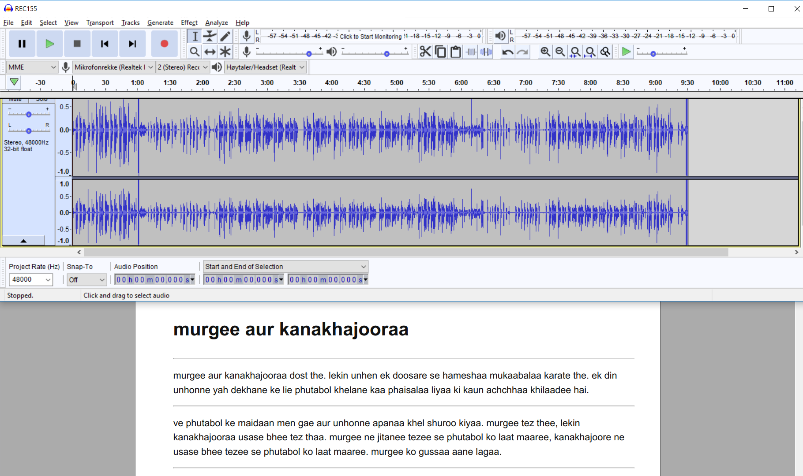
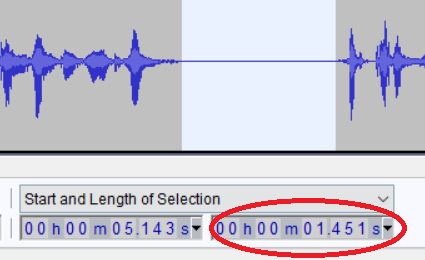
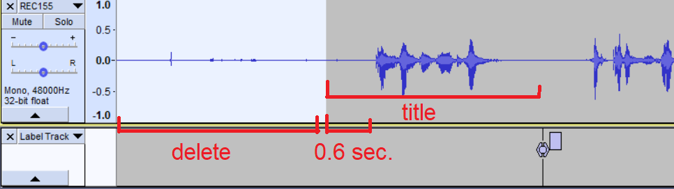
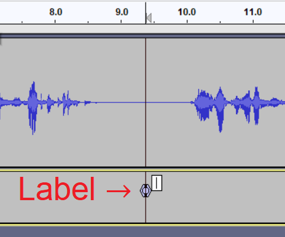
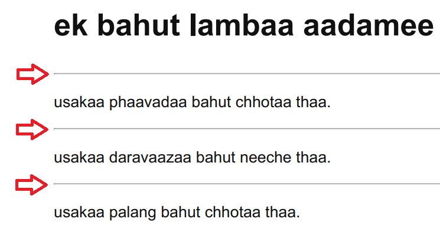
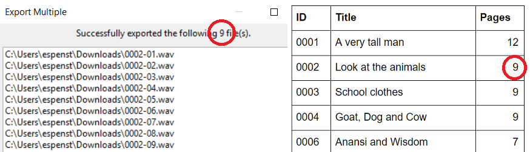
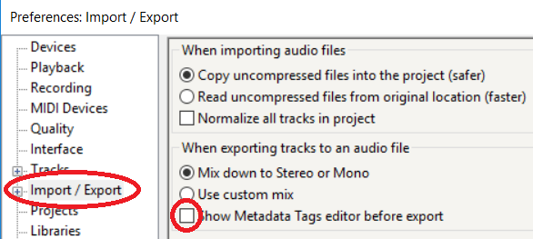

# Guidelines for audio editing

## Table of contents

* [Preparation](#preparation)
* [Audacity shortcuts](#audacity-shortcuts)
* [Silences](#silences)
* [Editing](#editing)
* [Exporting](#exporting)
* [Special issues](#special-issues)

## Preparation

1. [Download Audacity](https://www.audacityteam.org/download/) and install it.
2. Note: Make sure to download the appropriate version of Audacity for your operating system.
3. Open Audacity.
4. In Audacity, import the audio recording for editing (File > Import > Audio)
5. Open the PDF manuscript with the stories so that you can read and review the original text while editing the audio.
6. It's a good idea to resize Audacity to the top half of the screen and the PDF to the bottom half of the screen. Your screen should now look something like this:
  
7. If the audio file has two tracks (like the two two blue audio graphs in the screenshot above), mix them down to one track (Track > Mix > Mix Stereo down to Mono)

## Audacity shortcuts

* It's very useful to learn the (main) shortcuts, since it makes editing a lot faster. The main shortcuts are:
  * `Spacebar`: Play/stop
  * `P`: Pause
  * `Home key`: Go to beginning of track (Mac: Cmd + left arrow)
  * `Ctrl/Cmd + B`: Add label at cursor position
  * `Ctrl/Cmd + 1`: Zoom in
  * `Ctrl/Cmd + 2`: Zoom to normal
  * `Ctrl/Cmd + 3`: Zoom out
  * `Left/right arrow keys`: Move cursor
  * `Shift + arrow keys`: Move and highlight
  * `Shift + click`: Highlight

## Silences

There should be some silence at the beginning and end of a recording, as well as between pages and sentences. There are usually some pauses in the raw file, and these are usually too long and need to be trimmed down as following:

* Beginning of the story: 0.6 seconds (approx.)
* End of story: 1 second (approx.)
* Between pages: 1.25 seconds (approx.) in longer stories (levels 3--5), and 1.1 seconds (approx.) in short stories (levels 1--2).
* Pauses between sentences are usually natural and rarely require editing, but if they are too long, they can be trimmed down to 1 second (approx.)

With some experience these silences can be gauged by eye (use normal zoom level for consistency). To get an accurate measurement, look at the bottom of the editing window for a drop-down menu labelled "Start and End of Selection". Click on it and change the option to "Start and Length of Selection" instead. The exact length of the selected audio will then be displayed in the right-hand box below the menu (see screenshot below).

## Editing

The majority of the editing process consists of removing excess silence and recording errors from the audio track. When text is misread (for example, due to an error in pronunciation), or re-read for some other reason, the first takes are deleted, while the final recording of that segment/page is kept.

Before all pages (**important note**: including before the very beginning of each track), a label must be inserted. This is used to split the audio file into smaller files -- one for each page (including the title of the story).

The editing steps are as follows:

1. Trim the initial silence (before the title of the story) down to 0.6 seconds (approx.). Make sure you delete visible/audible distortions and leave a more or less flat waveform (see screenshot below).
  
2. Go to the beginning of the track (shortcut: press the `Home` key) and insert a label (shortcut: `Ctrl/Cmd + B`). There is no need to assign a label in the box that appears. Escape the label text box by clicking outside the text box (anywhere on the audio graph). The cursor is in the label text box (white) in the screenshot below.
  
3. Play the audio and read the manuscript at the same time. For each page break (see screenshot below), starting with the title, trim the silence down to approx. 1.25 (longer stories) or 1.1 (short stories) if the silence is longer than 1.5 seconds.
  
    * When trimming excessive audio, delete very noticeable sound distortions such as clicks and coughs, but don't trim too close to the end of a recording.
    * Some final sounds are barely visible in the graph, but nevertheless clearly audible. So always leave at least 0.25 seconds after the visible end of a sound segment you want to keep.
4. Insert a label between all pages, including the title and the first page.
5. When an audio segment has been reread, delete the misread segments using the mouse and/or arrow keys to highlight, but keep the final version.

## Exporting

When the editing is complete, the complete audio as well as the pages must be exported to the `.wav` file format.

1. Click on `File` > `Export` > `Export multiple...` This exports the audio for each page as a separate file.
2. Choose the folder you want to export to. Choose `WAV signed 16 bit` as the format.
3. Click `Export`. Ignore "Edit Metadata Tags", and click `OK`. You will then get a message saying "Successfully exported the following **N** file(s)", where N is a number (see screenshot below). This number (N) should match the number of pages in that particular story (see [this list](https://globalstorybooks.net/guidelines/sections/)). If it does not, the labeling is wrong, and you need to delete the exported wav files and return to editing the original audio in order to add or remove labels as appropriate, and export again.
  
4. The final step is to export the whole story:
    * Click on `File` > `Export` > `Export as WAV`, and save the file.

## Special issues

* In case a silence is too short, or it is noisy and needs to be replaced with actual silence, do NOT insert silence from the menu, but copy-paste a silent segment from elsewhere in the recording.
* To skip the metadata tag prompt, go to `Edit` > `Preferences...` > `Import / Export` and untick "Show Metadata Tags editor before export" (see screenshot below).
  

## Other guidelines

* [Process Outline](https://globalstorybooks.net/guidelines/process/)
* [Translation guidelines](https://globalstorybooks.net/guidelines/translation/)
* [Audio recording guidelines - producers](https://global-asp.github.io/guidelines/audio_producers/)
* [Audio recording guidelines - readers](https://global-asp.github.io/guidelines/audio_readers/)
